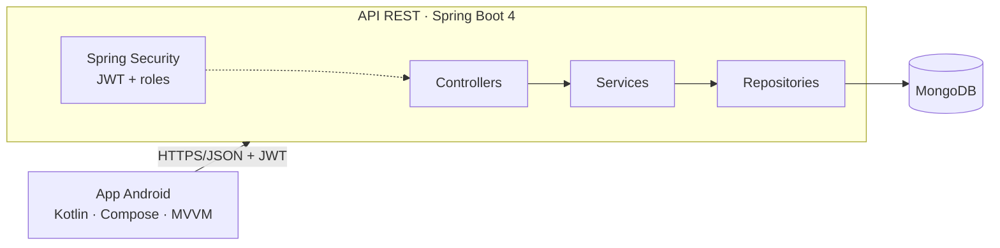

# Águia Branca · Plataforma de Inovação

Challenge FIAP — 2º ano, Fase 6 (Sprint 2). Backend REST em Java com MongoDB e app Android integrado,
para registrar ideias da operação, priorizá-las, transformá-las em projetos e acompanhar os resultados.

| Pasta | Conteúdo |
|---|---|
| [`backend/`](backend/) | API REST — Java 21, Spring Boot 4, Spring Security (JWT), MongoDB |
| [`app/`](app/) | App Android — Kotlin, Jetpack Compose, MVVM, Retrofit |
| [`docs/`](docs/) | Arquitetura, endpoints e apresentação |

> Tudo roda na sua máquina. Não há serviço na nuvem nem cadastro em lugar nenhum.

---

## 1. Pré-requisitos

| Para | Precisa de |
|---|---|
| Rodar a API | [Docker](https://docs.docker.com/get-docker/) com Docker Compose |
| Rodar o app | [Android Studio](https://developer.android.com/studio) (com um emulador) **ou** um celular Android |

Não é preciso instalar Java, Maven, MongoDB nem Kotlin: o Docker compila a API e o Android Studio cuida do app.

## 2. Subir a API

```bash
cd backend
docker compose up --build
```

A primeira execução baixa as imagens e as dependências e leva alguns minutos. A API está pronta quando o
log mostrar `Started InovacaoApiApplication`.

| Recurso | Endereço |
|---|---|
| API | http://localhost:8080/api |
| Swagger (documentação viva) | http://localhost:8080/swagger-ui.html |
| Health | http://localhost:8080/actuator/health |

O banco já sobe populado: 5 usuários, 3 orientações estratégicas, 5 ideias e 11 projetos.

Para parar: `Ctrl+C` e depois `docker compose down`. Para zerar o banco: `docker compose down -v`.

## 3. Rodar o app

### Opção A — emulador (recomendada)

1. Abra a pasta `app/` no Android Studio (`File → Open`).
2. Aguarde a sincronização do Gradle.
3. `Run → Run 'app'` em um emulador com Android 7.0 (API 24) ou superior.

No emulador, o endereço `10.0.2.2` aponta para o computador onde a API está rodando. Já é o padrão do projeto,
não precisa configurar nada.

### Opção B — celular Android

O celular precisa estar na mesma rede do computador. Descubra o IP da máquina (`hostname -I` no Linux,
`ipconfig` no Windows) e gere o APK apontando para ele:

```bash
cd app
./gradlew assembleDebug -PapiBaseUrl=http://192.168.0.10:8080/
```

O APK fica em `app/build/outputs/apk/debug/app-debug.apk`. Transfira para o celular e instale.

## 4. Usuários de teste

Senha de todos: `senha123`.

| E-mail | Perfil | Nome |
|---|---|---|
| `operador@aguiabranca.com` | Operador | João Costa |
| `ana.lima@aguiabranca.com` | Operador | Ana Lima |
| `roberto.mendes@aguiabranca.com` | Operador | Roberto Mendes |
| `gestor@aguiabranca.com` | Gestor | Maria Silva |
| `lideranca@aguiabranca.com` | Liderança | Paulo Andrade |

## 5. Roteiro para avaliação

Percorrendo estes passos você vê todos os requisitos do desafio funcionando em poucos minutos.

**Operador** (`operador@aguiabranca.com`)
1. A tela inicial mostra a orientação estratégica vigente e apenas as ideias deste operador.
2. Toque no **+**, preencha uma ideia e escolha a orientação a que ela se vincula.
3. Abra a ideia criada: dá para editar e excluir enquanto ninguém a avaliou.

**Gestor** (`gestor@aguiabranca.com`)
1. O painel traz ideias novas, em análise e projetos ativos, contados pela API.
2. Em **ver fila**, filtre por etapa, prioridade e área.
3. Abra uma ideia: mude a prioridade, avance a etapa ou rejeite informando o motivo.
4. Em **gerenciar** projetos: crie um projeto, atualize etapa e progresso e registre os resultados.

**Liderança** (`lideranca@aguiabranca.com`)
1. O dashboard traz os 6 indicadores e três gráficos: lucro por orientação, projetos por situação e ideias por etapa.
2. No ícone de bandeira, gerencie as orientações: criar, editar, excluir e ver o histórico de alterações.
3. Toque em um projeto para ver investimento, retorno, lucro, ROI, custo evitado e produtividade.

**Controle de acesso:** tente, pelo Swagger, usar o token do operador em `/api/projetos` — a resposta é 403.
Cada perfil só enxerga e faz o que lhe cabe, e o app respeita isso.

## 6. Arquitetura



- **App:** telas em Compose, estado nos ViewModels, `InovacaoRepository` como única fonte de dados.
  Um grafo de navegação por perfil.
- **API:** camadas `controller → service → repository`, DTOs separados dos documentos, erros padronizados
  em JSON e permissão por perfil declarada em cada rota.
- **Banco:** MongoDB, com valores financeiros em decimal e índice único no e-mail do usuário.

## 7. Endpoints

Lista completa e testável no Swagger. Resumo:

| Método | Rota | Perfis |
|---|---|---|
| POST | `/api/auth/login` | público |
| GET | `/api/auth/me` | autenticado |
| GET | `/api/orientacoes` · `/{id}` · `/{id}/historico` | todos |
| POST · PUT · DELETE | `/api/orientacoes` | LIDERANCA |
| GET | `/api/ideias` · `/{id}` | operador vê as próprias; gestor e liderança veem todas |
| POST · PUT · DELETE | `/api/ideias` | OPERADOR (autor, enquanto `ENVIADA`) |
| PATCH | `/api/ideias/{id}/prioridade` · `/status` | GESTOR |
| GET | `/api/projetos` · `/{id}` | GESTOR · LIDERANCA |
| POST · PUT · DELETE | `/api/projetos` | GESTOR |
| PATCH | `/api/projetos/{id}/progresso` · `/resultados` | GESTOR |
| GET | `/api/dashboard/gestor` | GESTOR |
| GET | `/api/dashboard/resumo` · `/orientacoes` · `/orientacoes/{id}` · `/projetos/{id}` | LIDERANCA |

## 8. Regras de negócio

- **Ideias** nascem como `ENVIADA`, sempre vinculadas a uma orientação. O autor edita e exclui apenas
  enquanto ninguém avaliou. O gestor conduz o fluxo
  `ENVIADA → TRIAGEM/ANALISE → DECISAO → PROJETO`, ou rejeita informando o motivo.
- **Projetos** podem nascer de uma ideia em `DECISAO`: a ideia então vira `PROJETO` e não pode originar outro.
- **Orientações** têm exclusão lógica: somem das listas, mas o histórico e os vínculos são preservados.
  Toda alteração grava data, categoria, campanha e autor.
- **Indicadores** são sempre calculados, nunca guardados: `ROI = (retorno − investimento) / investimento`.

## 9. Testes

69 testes de integração, com MongoDB em container (Testcontainers):

```bash
cd backend
docker run --rm --network host -v "$PWD":/workspace -w /workspace \
  -v /var/run/docker.sock:/var/run/docker.sock -v inovacao-m2:/root/.m2 \
  eclipse-temurin:21-jdk ./mvnw -B test
```

Com JDK 21 instalado, basta `./mvnw test`.

## 10. Configuração

Todas as variáveis têm valor padrão; para alterar, copie `backend/.env.example` para `backend/.env`.

| Variável | Padrão | Para quê |
|---|---|---|
| `API_PORT` | `8080` | porta da API na sua máquina |
| `MONGODB_URI` | `mongodb://mongo:27017/inovacao` | conexão com o banco |
| `JWT_SECRET` | segredo de desenvolvimento | chave que assina os tokens (mín. 32 caracteres) |
| `JWT_EXPIRATION` | `8h` | validade do token |
| `SEED_ENABLED` | `true` | cria os dados de demonstração na primeira subida |

## 11. Solução de problemas

| Sintoma | O que fazer |
|---|---|
| `port is already allocated` ao subir | outra coisa usa a porta 8080: `API_PORT=8090` no `.env` e use `-PapiBaseUrl=http://10.0.2.2:8090/` |
| App abre mas não carrega nada | confira se a API responde: http://localhost:8080/actuator/health |
| App no celular não conecta | celular e computador precisam estar na mesma rede, e o APK precisa ter sido gerado com o IP da máquina |
| `permission denied` no Docker (Linux) | rode com `sudo` ou adicione seu usuário ao grupo `docker` |
| Quero recomeçar do zero | `docker compose down -v` apaga o banco; na próxima subida ele é populado de novo |

## 12. Entrega

Challenge Grupo Águia Branca — Sprint 2 · Grupo 42 · FIAP 2TDS.

Planejamento e andamento das tarefas em [PLANEJAMENTO.md](PLANEJAMENTO.md).
