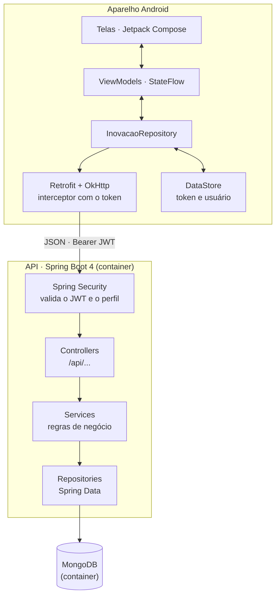
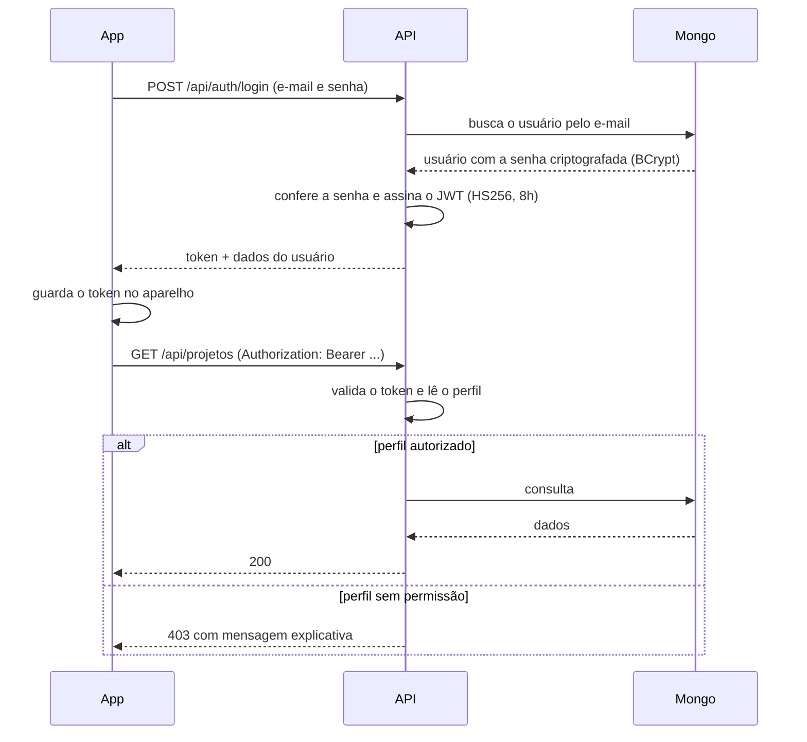
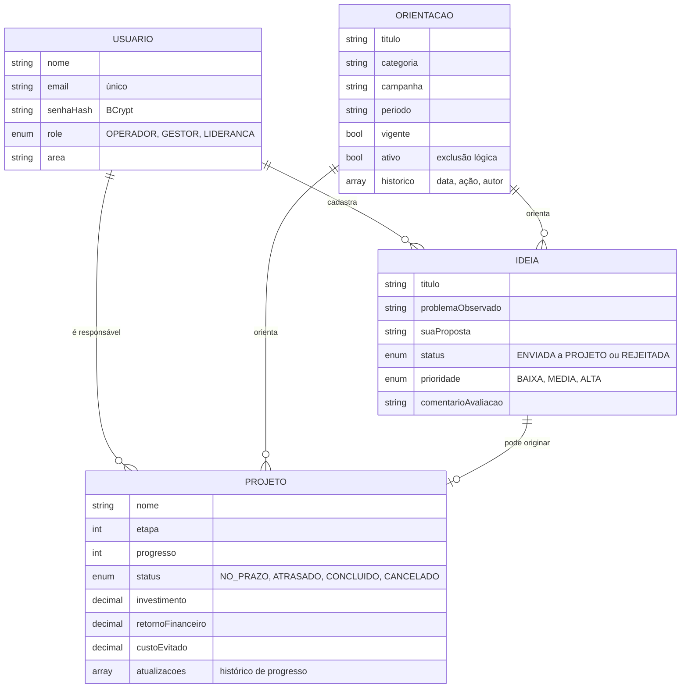
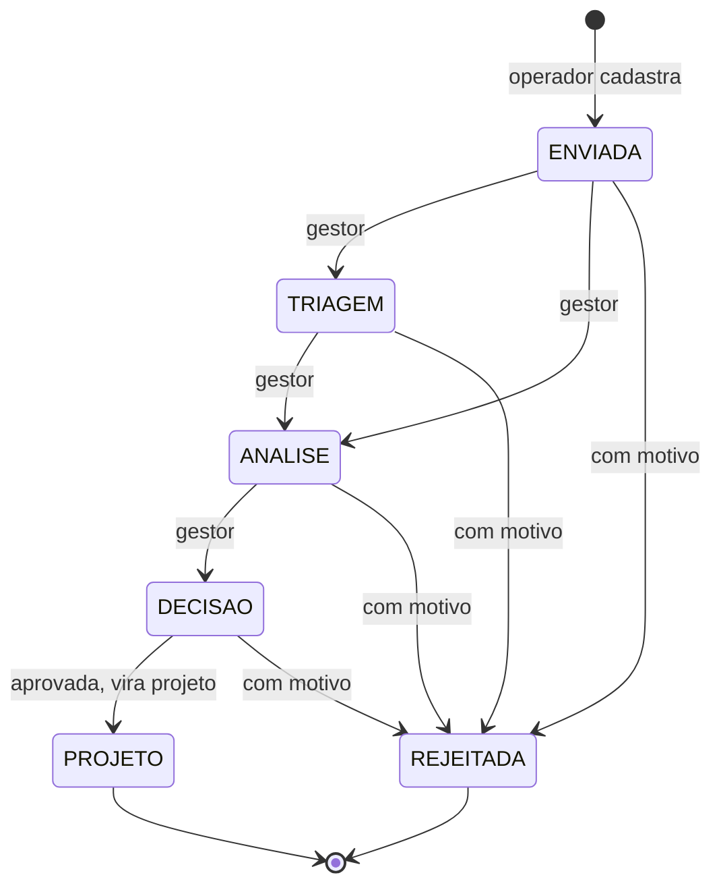

# Arquitetura

## Visão geral

Os dois containers sobem juntos com `docker compose up` em `backend/`. O app, no emulador, alcança a API
pelo endereço `10.0.2.2`, que aponta para o computador.

## Autenticação e permissões

O perfil do usuário viaja dentro do token, e cada rota declara quem pode acessá-la. O app também organiza
a navegação por perfil, então cada pessoa só chega às telas que lhe cabem — mas quem decide é sempre a API.

## Domínio

## Ciclo de vida da ideia

O operador só edita ou exclui a ideia enquanto ela está em `ENVIADA`. Qualquer transição fora deste fluxo
é recusada pela API com 409.

## Camadas do backend

| Camada | Responsabilidade |
|---|---|
| `controller` | recebe a requisição, valida o formato e declara qual perfil pode acessar |
| `service` | regras de negócio: quem é dono do quê, transições de status, cálculo dos indicadores |
| `repository` | acesso ao MongoDB |
| `domain` | documentos e enums |
| `dto` | contratos de entrada e saída, separados dos documentos |
| `security` | emissão e validação do JWT, respostas 401 e 403 em JSON |
| `exception` | tratamento global de erros no formato padronizado |
| `config` | segurança, OpenAPI, índices do banco e dados de demonstração |

## Decisões e porquês

| Decisão | Motivo |
|---|---|
| MongoDB com Spring Data | o desafio pede banco NoSQL; o equivalente ao JPA no mundo Mongo |
| JWT pelo próprio Spring Security | evita biblioteca extra e filtro escrito à mão |
| Indicadores calculados, nunca guardados | lucro e ROI nunca ficam inconsistentes com investimento e retorno |
| Valores financeiros em decimal | evita erro de arredondamento em dinheiro |
| Exclusão lógica de orientações | preserva o histórico e os vínculos com ideias e projetos |
| Gráficos desenhados em Canvas | sem dependência externa no app |
| Um grafo de navegação por perfil | cada perfil só carrega os dados que pode ver |
